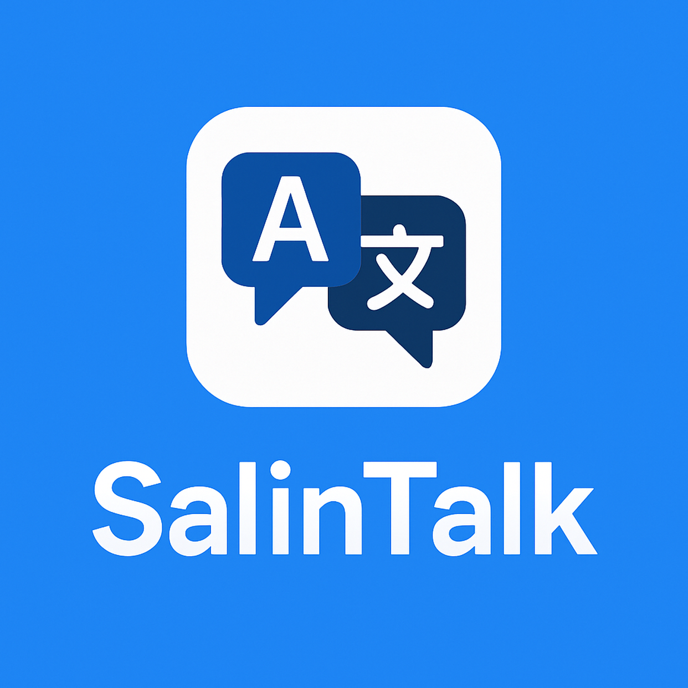
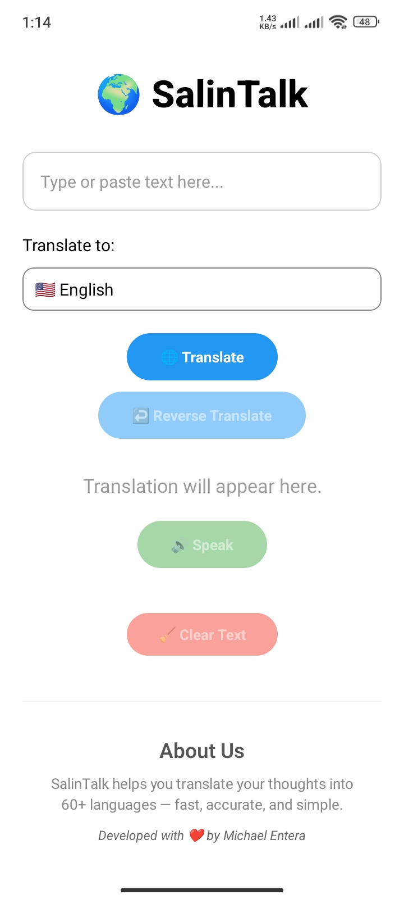
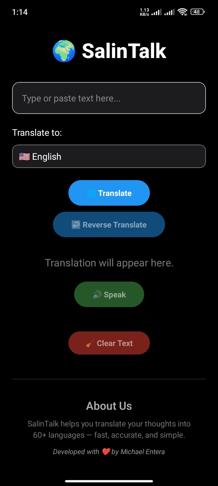
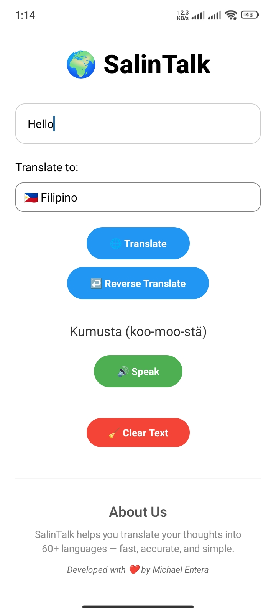
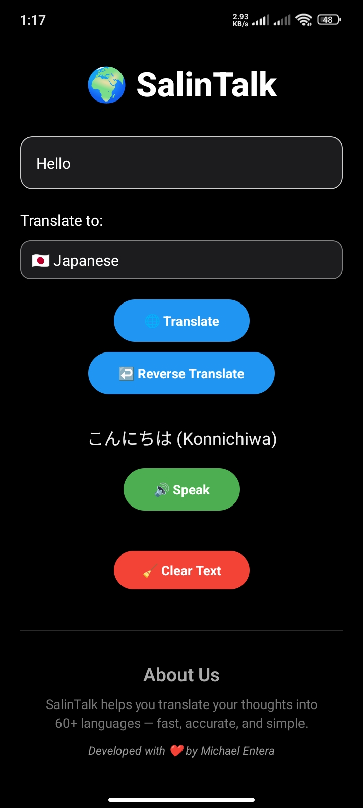

# 🌐 SalinTalk

**SalinTalk** is a multilingual speech and text translator powered by **Gemini AI**.  
Type or paste any sentence, translate it into **60+ languages**, and hear the pronunciation instantly.  
Perfect for **travelers**, **language learners**, and **everyday conversations**.

---

## ✨ Features

- 🔤 Translate to/from **60+ languages**
- 🗣️ Speak the translated phrase
- 📋 Copy to clipboard with one tap
- ↩️ Reverse translation
- 🧹 Clear text function
- 🎨 Auto dark/light theme support
- 📱 Clean, responsive UI
- 📌 Offline-ready splash and app icon

---

## ⚙️ Tech Stack

- [React Native](https://reactnative.dev/)
- [Expo](https://expo.dev/)
- [Gemini API](https://ai.google.dev/)
- [expo-speech](https://docs.expo.dev/versions/latest/sdk/speech/)
- [react-native-picker-select](https://github.com/lawnstarter/react-native-picker-select)

---

## 📦 Installation

git clone https://github.com/shshshangelo/salintalk.git
cd salintalk
npm install
npx expo start

## 🧠 Environment Variables

Create a .env file at the root of your project with the following content:

GEMINI_API_KEY=your_google_gemini_api_key

Make sure you're using:
react-native-dotenv
babel-plugin-dotenv-import (or equivalent)

## 📸 Screenshots

## 🙌 About Me

SalinTalk is proudly developed by Michael Entera.
A small tool with a big goal: break the language barrier.
